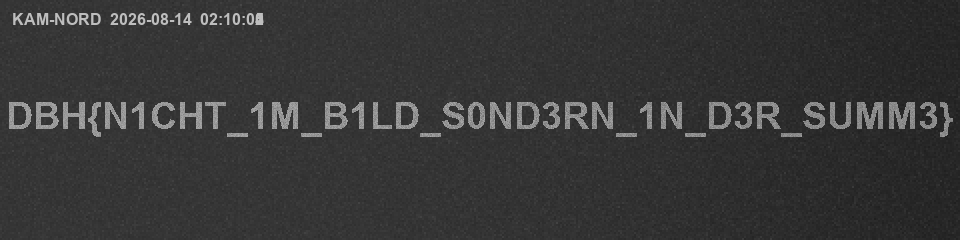

# Langzeit

## Challenge description
```
Die Kamera am Nordtor hat in der fraglichen Nacht durchgehend aufgezeichnet. Die Ermittler haben sich das Material angesehen, Bild für Bild und nichts gefunden. Sechs Sekunden Dunkelheit, Sensorrauschen, ein Zeitstempel.

Die Aufzeichnung wurde trotzdem asserviert, weil das Protokoll für genau dieses Fenster einen Eintrag führt.
```

## Available artifact
- `MKV` file: `kamera_nord.mkv`

## Solution

As stated in the [challenge description](#challenge-description), there was nothing visibly interesting in the video. The `file` command reveals that the given artifact is a Matroska file.
```bash
┌──(kali㉿xDCx)-[~]
└─$ file kamera_nord.mkv
kamera_nord.mkv: Matroska data
```

`exiftool` does not reveal any useful information that could help with the analysis. Since the artifact is a Matroska file, `mkvinfo` is a suitable tool for examining its internal structure.

```bash
┌──(kali㉿xDCx)-[~]
└─$ mkvinfo -v kamera_nord.mkv

+ EBML head
|+ EBML version: 1
|+ EBML read version: 1
|+ Maximum EBML ID length: 4
|+ Maximum EBML size length: 8
|+ Document type: matroska
|+ Document type version: 4
|+ Document type read version: 2
+ Segment: size 8115358
|+ Seek head (subentries will be skipped)
|+ EBML void: size 82
|+ Segment information
| + Timestamp scale: 1000000
| + Multiplexing application: Lavf
| + Writing application: Lavf
| + Duration: 00:00:06.000000000
|+ Tracks
| + Track
|  + Track number: 1 (track ID for mkvmerge & mkvextract: 0)
|  + Track UID: 1
|  + "Lacing" flag: 0
|  + Language: und
|  + "Default track" flag: 0
|  + Codec ID: V_FFV1
|  + Track type: video
|  + Default duration: 00:00:00.040000000 (25.000 frames/fields per second for a video track)
|  + Video track
|   + Pixel width: 960
|   + Pixel height: 240
|   + Interlaced: 2
|   + Display unit: 4
|   + Video color information
|    + Color range: 2
|  + Maximum block additional ID: 0
|  + EBML void: size 2
|  + Codec's private data: size 42
|+ Tags
| + Tag
|  + Targets
|   + Track UID: 1
|  + Simple
|   + Name: ENCODER
|   + String: Lavc ffv1
|  + Simple
|   + Name: DURATION
|   + String: 00:00:06.000000000
|+ Cluster
| + Cluster timestamp: 00:00:00.000000000
| + Simple block: key, track number 1, 1 frame(s), timestamp 00:00:00.000000000
|  + Frame with size 54429
| + Simple block: track number 1, 1 frame(s), timestamp 00:00:00.040000000
|  + Frame with size 54340
| + Simple block: track number 1, 1 frame(s), timestamp 00:00:00.080000000
|  + Frame with size 54380
| + Simple block: track number 1, 1 frame(s), timestamp 00:00:00.120000000
|  + Frame with size 54072
| + Simple block: track number 1, 1 frame(s), timestamp 00:00:00.160000000
|  + Frame with size 54331
| + Simple block: track number 1, 1 frame(s), timestamp 00:00:00.200000000
|  + Frame with size 53854
| + Simple block: track number 1, 1 frame(s), timestamp 00:00:00.240000000
|  + Frame with size 54081
| + Simple block: track number 1, 1 frame(s), timestamp 00:00:00.280000000
|  + Frame with size 53760
| + Simple block: track number 1, 1 frame(s), timestamp 00:00:00.320000000
|  + Frame with size 53988
| + Simple block: track number 1, 1 frame(s), timestamp 00:00:00.360000000
|  + Frame with size 53741
| + Simple block: track number 1, 1 frame(s), timestamp 00:00:00.400000000
|  + Frame with size 54129
| + Simple block: track number 1, 1 frame(s), timestamp 00:00:00.440000000
|  + Frame with size 54083
|+ Cluster
| + Cluster timestamp: 00:00:00.480000000
...
|+ Cluster
| + Cluster timestamp: 00:00:05.760000000
| + Simple block: key, track number 1, 1 frame(s), timestamp 00:00:05.760000000
|  + Frame with size 54031
| + Simple block: track number 1, 1 frame(s), timestamp 00:00:05.800000000
|  + Frame with size 54411
| + Simple block: track number 1, 1 frame(s), timestamp 00:00:05.840000000
|  + Frame with size 53692
| + Simple block: track number 1, 1 frame(s), timestamp 00:00:05.880000000
|  + Frame with size 53892
| + Simple block: track number 1, 1 frame(s), timestamp 00:00:05.920000000
|  + Frame with size 53894
| + Simple block: track number 1, 1 frame(s), timestamp 00:00:05.960000000
|  + Frame with size 54169
|+ Cues (subentries will be skipped)
```

The output reveals that the video consists of multiple clusters containing individual frames and their corresponding timestamps. The video has a duration of 6 seconds and a frame rate of 25 FPS, resulting in 150 frames in total.

Since the frame themselves may contain hidden information, they can be extracted individually. Therefore, `ffmpeg` is well suited for this task, as it supports a wide range of audio and video formats.

First, a directory is created to store the extracted frames. The `.mkv` file can then be converted into individual PNG images: 

```bash
┌──(kali㉿xDCx)-[~]
└─$ mkdir frames

┌──(kali㉿xDCx)-[~]
└─$ ffmpeg -i kamera_nord.mkv frames/frame_%04d.png
ffmpeg version 8.1.1-3 Copyright (c) 2000-2026 the FFmpeg developers
built with gcc 15 (Debian 15.2.0-17)
configuration: --prefix=/usr --extra-version=3 --toolchain=hardened --libdir=/usr/lib/x86\_64-linux-gnu --incdir=/usr/include/x86\_64-linux-gnu --arch=amd64 --enable-gpl --disable-stripping --disable-pocketsphinx --disable-libcaca --disable-libmfx --disable-omx --enable-gnutls --enable-libaom --enable-libass --enable-libbs2b --enable-libcdio --enable-libcodec2 --enable-libdav1d --enable-libflite --enable-libfontconfig --enable-libfreetype --enable-libfribidi --enable-libglslang --enable-libgme --enable-libgsm --enable-libharfbuzz --enable-libmp3lame --enable-libmysofa --enable-libopenjpeg --enable-libopenmpt --enable-libopus --enable-librubberband --enable-libshine --enable-libsnappy --enable-libsoxr --enable-libspeex --enable-libtheora --enable-libtwolame --enable-libvidstab --enable-libvorbis --enable-libvpx --enable-libwebp --enable-libx265 --enable-libxml2 --enable-libxvid --enable-libzimg --enable-openal --enable-opencl --enable-opengl --disable-sndio --enable-libvpl --enable-libdc1394 --enable-libdrm --enable-libiec61883 --enable-chromaprint --enable-frei0r --enable-ladspa --enable-libbluray --enable-libdvdnav --enable-libdvdread --enable-libjack --enable-libjxl --enable-libpulse --enable-librabbitmq --enable-librist --enable-libsrt --enable-libssh --enable-libsvtav1 --enable-libx264 --enable-libzmq --enable-libzvbi --enable-lv2 --enable-sdl2 --enable-libplacebo --enable-librav1e --enable-librsvg --enable-shared

libavutil      60. 26.101 / 60. 26.101
libavcodec     62. 28.101 / 62. 28.101
libavformat    62. 12.101 / 62. 12.101
libavdevice    62.  3.101 / 62.  3.101
libavfilter    11. 14.101 / 11. 14.101
libswscale      9.  5.101 /  9.  5.101
libswresample   6.  3.101 /  6.  3.101

Input #0, matroska,webm, from 'kamera_nord.mkv':
Metadata:
  encoder         : Lavf
Duration: 00:00:06.00, start: 0.000000, bitrate: 10820 kb/s
Stream #0:0: Video: ffv1, gray(pc, progressive), 960x240, 25 fps, 25 tbr, 1k tbn

Metadata:

    ENCODER         : Lavc ffv1
    DURATION        : 00:00:06.000000000

Stream mapping:
Stream #0:0 -> #0:0 (ffv1 (native) -> png (native))

Press [q] to stop, [?] for help
Output #0, image2, to 'frames/frame_%04d.png':

Metadata:
  encoder         : Lavf62.12.101

Stream #0:0: Video: png, gray(pc, progressive), 960x240, q=2-31, 200 kb/s, 25 fps, 25 tbn
  Metadata:

    encoder         : Lavc62.28.101 png

    DURATION        : 00:00:06.000000000

[out#0/image2 @ 0x5915ddf98000] video:8717KiB audio:0KiB subtitle:0KiB other streams:0KiB global headers:0KiB muxing overhead: unknown
frame=  150 fps=0.0 q=-0.0 Lsize=N/A time=00:00:06.00 bitrate=N/A speed=21.8x elapsed=0:00:00.27
```

As expected, 150 frames were extracted from the `.mkv` file. Inspecting the frames reveals numerous white dots. Their distribution does not appear to be random, suggesting that the individual frames may need to be combined to reveal the hidden information. 

For that, a small Python script was written (see: [combine.py](combine.py)).

After executing the script, the reconstructed image is saved as `stack_img.png`. Opening the resulting image reveals the flag!



## Flag
```
DBH{N1CHT_1M_B1LD_S0ND3RN_1N_D3R_SUMM3}
```