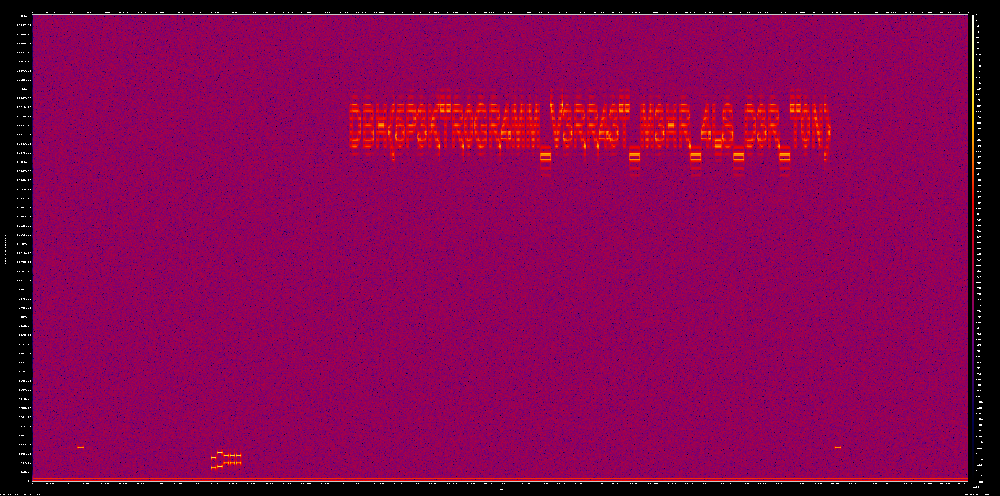

# Notruf

## Challenge description
```
Aus dem Aufzeichnungssystem einer Leitstelle stammt ein 42 Sekunden langer Mitschnitt einer Funkstrecke. Aufgefallen ist er, weil das Bandprotokoll für dieses Zeitfenster eine Übertragung ausweist aber praktisch nichts zu hören ist.
```

## Available artifacts
- Audio file: `notruf.wav`

## Solution
Since the [challenge description](#challenge-description) mentioned that there is nothing to hear when playing the audio file, this might means that it contains embedded files. Therefore `binwalk` is used to find them. 

```bash
┌──(kali㉿xDCx)-[~]
└─$ binwalk notruf.wav

DECIMAL       HEXADECIMAL     DESCRIPTION
--------------------------------------------------------------------------------

0             0x0             RIFF audio data (WAV), PCM, 1 channels, 48000 sample rate
2602359       0x27B577        MySQL ISAM compressed data file Version 5
2603994       0x27BBDA        MySQL MISAM index file Version 6
2661820       0x289DBC        MySQL ISAM index file Version 7
2713337       0x2966F9        mcrypt 2.2 encrypted data, algorithm: GOST, mode: CBC, keymode: 8bit
```

This look very suspicious, especially that `MySQL` and `mcrypt` were found there. But unfortunately nothing can be extracted here:

```bash
┌──(kali㉿xDCx)-[~]
└─$ binwalk -e notruf.wav

DECIMAL       HEXADECIMAL     DESCRIPTION
--------------------------------------------------------------------------------

WARNING: One or more files failed to extract: either no utility was found or it's unimplemented
```

So there must be another approach where the flag could be. Audio are basically waves which its frequencies can be represented visually as a spectrogram. Maybe this is where the flag hides?

For this step the tool `ffmpeg` is used to convert `notruf.wav` into a spectrogram.

```bash
┌──(kali㉿xDCx)-[~]
└─$ ffmpeg -i notruf.wav -filter_complex showspectrumpic spectrogram_1.png
ffmpeg version 8.1.1-3 Copyright (c) 2000-2026 the FFmpeg developers
  built with gcc 15 (Debian 15.2.0-17)
  configuration: --prefix=/usr --extra-version=3 --toolchain=hardened --libdir=/usr/lib/x86_64-linux-gnu --incdir=/usr/include/x86_64-linux-gnu --arch=amd64 --enable-gpl --disable-stripping --disable-pocketsphinx --disable-libcaca --disable-libmfx --disable-omx --enable-gnutls --enable-libaom --enable-libass --enable-libbs2b --enable-libcdio --enable-libcodec2 --enable-libdav1d --enable-libflite --enable-libfontconfig --enable-libfreetype --enable-libfribidi --enable-libglslang --enable-libgme --enable-libgsm --enable-libharfbuzz --enable-libmp3lame --enable-libmysofa --enable-libopenjpeg --enable-libopenmpt --enable-libopus --enable-librubberband --enable-libshine --enable-libsnappy --enable-libsoxr --enable-libspeex --enable-libtheora --enable-libtwolame --enable-libvidstab --enable-libvorbis --enable-libvpx --enable-libwebp --enable-libx265 --enable-libxml2 --enable-libxvid --enable-libzimg --enable-openal --enable-opencl --enable-opengl --disable-sndio --enable-libvpl --enable-libdc1394 --enable-libdrm --enable-libiec61883 --enable-chromaprint --enable-frei0r --enable-ladspa --enable-libbluray --enable-libdvdnav --enable-libdvdread --enable-libjack --enable-libjxl --enable-libpulse --enable-librabbitmq --enable-librist --enable-libsrt --enable-libssh --enable-libsvtav1 --enable-libx264 --enable-libzmq --enable-libzvbi --enable-lv2 --enable-sdl2 --enable-libplacebo --enable-librav1e --enable-librsvg --enable-shared
  libavutil      60. 26.101 / 60. 26.101
  libavcodec     62. 28.101 / 62. 28.101
  libavformat    62. 12.101 / 62. 12.101
  libavdevice    62.  3.101 / 62.  3.101
  libavfilter    11. 14.101 / 11. 14.101
  libswscale      9.  5.101 /  9.  5.101
  libswresample   6.  3.101 /  6.  3.101
[aist#0:0/pcm_s16le @ 0x5f7b97d380c0] Guessed Channel Layout: mono
Input #0, wav, from 'notruf.wav':
  Duration: 00:00:42.00, bitrate: 768 kb/s
  Stream #0:0: Audio: pcm_s16le ([1][0][0][0] / 0x0001), 48000 Hz, mono, s16, 768 kb/s
Stream mapping:
  Stream #0:0 (pcm_s16le) -> showspectrumpic:default
  showspectrumpic:default -> Stream #0:0 (png)
Press [q] to stop, [?] for help
Output #0, image2, to 'spectrogram_1.png':
  Metadata:
    encoder         : Lavf62.12.101
  Stream #0:0: Video: png, rgb24(pc, gbr/unknown/unknown, progressive), 4380x2176 [SAR 1:1 DAR 1095:544], q=2-31, 200 kb/s, 1 fps, 1 tbn
    Metadata:
      encoder         : Lavc62.28.101 png
[image2 @ 0x5f7b97d38400] The specified filename 'spectrogram_1.png' does not contain an image sequence pattern or a pattern is invalid.
[image2 @ 0x5f7b97d38400] Use a pattern such as %03d for an image sequence or use the -update option (with -frames:v 1 if needed) to write a single image.
[out#0/image2 @ 0x5f7b97d38300] video:15622KiB audio:0KiB subtitle:0KiB other streams:0KiB global headers:0KiB muxing overhead: unknown
frame=    1 fps=0.7 q=-0.0 Lsize=N/A time=00:00:01.00 bitrate=N/A speed=0.717x elapsed=0:00:01.39
```

Once the process is complete, the image `spectrogram.png` will be opened. 

```bash
┌──(kali㉿xDCx)-[~]
└─$ xdg-open spectrogram.png
```



As can be seen on the spectrogram, the flag is displayed here.

## Flag
```
DBH{5P3KTR0GR4MM_V3RR43T_M3HR_4LS_D3R_T0N}
```